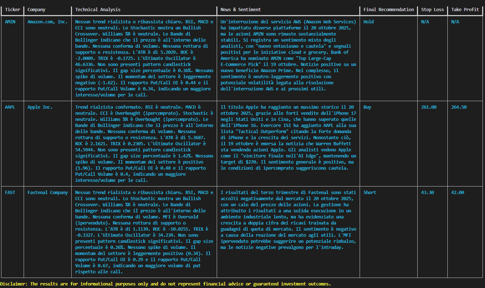

# 🍕 Pizza Trader
> An AI-powered quantitative trading assistant that combines technical analysis, options data, sector momentum, and news sentiment to provide comprehensive market insights.

[](https://www.python.org/downloads/)


## 📖 Overview

**Pizza Trader** is an intelligent trading research agent built with [Datapizza AI](https://docs.datapizza.ai/0.0.2/) and Google's Gemini LLM. It autonomously analyzes stock markets by integrating multiple data sources and technical indicators, delivering actionable trading insights in natural language.

The system leverages three specialized analysis tools:
- **Signal Analysis**: Price gaps, volume spikes, options flow (Put/Call ratios, open interest)
- **Expert Technical Signals**: 20+ indicators including RSI, MACD, Bollinger Bands, candlestick patterns, and more
- **News & Sentiment**: news aggregation via Finnhub API

## ✨ Features

- 🤖 **Conversational AI Interface**: Ask questions in natural language (multilingual support)
- 📊 **Comprehensive Technical Analysis**: TA-Lib integration with 20+ indicators
- 📰 **News Monitoring**: Automated analysis of news content
- 🎯 **Options Flow Analysis**: Put/Call ratios, open interest, and volume metrics
- 🔄 **Sector Rotation Signals**: Momentum tracking across 11 major market sectors
- 🛠️ **Modular Tool Architecture**: Easily extend with custom analysis methods

## 🚀 Quick Start

### Prerequisites

```bash
Python 3.12+
pip install -r requirements.txt
```

### Installation

1. **Clone the repository**
```bash
git clone https://github.com/deros92/pizza-trader.git
cd pizza-trader
```

2. **Install dependencies**
```bash
pip install yfinance pandas ta-lib python-dotenv requests datapizza-ai datapizza-ai-clients-google
```

3. **Configure API keys**

Create a `.env` file in the project root:
```env
GOOGLE_API_KEY=your_google_gemini_api_key
FINNHUB_API_KEY=your_finnhub_api_key
```

Get your API keys:
- Google Gemini: [Google AI Studio](https://makersuite.google.com/app/apikey)
- Finnhub: [Finnhub.io](https://finnhub.io/register)

### Usage

Run the agent:
```bash
python pizza_trader.py
```

**Example queries:**
```
> Should I buy Apple or Microsoft today?
> Compare Tesla and Amazon for intraday trading
> What's the technical outlook for NVDA?
> Analyze sentiment for META stock
```

The agent will:
1. Identify relevant tickers
2. Call appropriate analysis tools
3. Synthesize findings into a structured report with recommendations

## 🧰 Architecture

### Core Components

#### `MarketAnalyzer` Class
The main analysis engine with three tool-decorated methods:

1. **`analyze_signals(ticker_names: str)`**
   - Price gap analysis
   - Volume spike detection
   - Options data (calls/puts OI and volume)
   - Sector momentum integration

2. **`expert_signals(ticker_names: str)`**
   - Trend indicators (SMA, ADX, Parabolic SAR)
   - Momentum oscillators (RSI, MACD, Stochastic, CCI, Williams %R)
   - Volatility metrics (ATR, Bollinger Bands)
   - Volume analysis (OBV, MFI)
   - Candlestick pattern recognition (9 patterns)
   - Support/resistance levels

3. **`finnhub_news_analysis(ticker_names: str)`**
   - Last 3 days of company news


#### Agent Configuration
- **LLM**: Google Gemini 2.5 Flash
- **Framework**: Datapizza AI Agent
- **System Prompt**: Structured to generate consistent, professional trading reports

### Data Flow

```
User Query → Agent (LLM) → Tool Selection → MarketAnalyzer Methods
                ↓
        Data Aggregation (yfinance, Finnhub)
                ↓
        Technical Calculations (TA-Lib)
                ↓
        String Formatting (Tool Output)
                ↓
        LLM Synthesis → Structured Report → User
```

## 📊 Output Format

Each analysis follows this structure:



---


## 🛠️ Customization

### Add Custom Indicators

Extend the `MarketAnalyzer` class:

```python
@tool
def my_custom_analysis(self, ticker_names: str) -> str:
    """Your custom analysis logic"""
    # Your code here
    return formatted_results

# Register in agent
agent = Agent(
    name="Pizza Trader",
    tools=[
        analyzer.analyze_signals,
        analyzer.expert_signals,
        analyzer.finnhub_news_analysis,
        analyzer.my_custom_analysis  # Add here
    ]
)
```

### Modify System Prompt

Edit the `system_prompt` parameter in the `Agent` constructor to change:
- Output format
- Analysis depth
- Risk tolerance
- Language preferences

## 📦 Dependencies

- **yfinance**: Market data retrieval
- **pandas**: Data manipulation
- **TA-Lib**: Technical analysis indicators
- **requests**: API calls
- **datapizza-ai**: Agent orchestration framework
- **datapizza.clients.google**: LLM backend
- **python-dotenv**: Environment variable management

## ⚠️ Disclaimer

This tool is designed for **educational and research purposes only**. 

- Not financial advice
- Past performance does not guarantee future results
- Always conduct your own due diligence
- Consider consulting a licensed financial advisor
- Use at your own risk


## 📄 License

This project is licensed under the MIT License - see the [LICENSE](LICENSE) file for details.

## 🙏 Acknowledgments

- [Datapizza AI](https://docs.datapizza.ai/0.0.2/) for the agent framework
- [TA-Lib](https://ta-lib.org) for technical analysis functions
- [yfinance](https://github.com/ranaroussi/yfinance) for market data
- [Finnhub](https://finnhub.io) for news API


